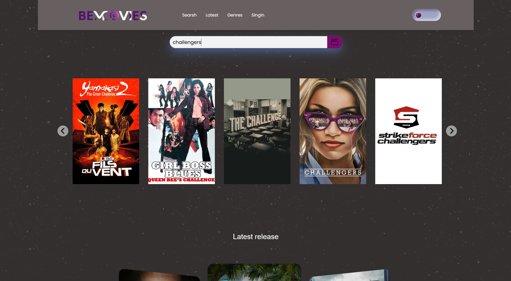
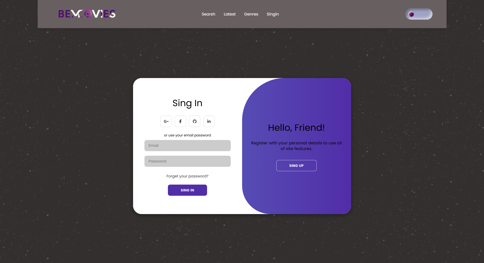

# BeMovies

Welcome to BeMovies, an app for discovering films!  
This application lets you check the latest releases,  
sort films by genre and search for films to find out more about them. 


## Overview




# Features

- View the latest movie releases.
- Sort movies by genre.
- Search for specific films.
- See details of a film: year of release, rating, description, genres and cast.
- Light/dark mode toggle


# Tech Stack

**Client:** 
- HTML/CSS (Sass) for the front-end.
- JavaScript for dynamic functionalities.
- TMDB API to retrieve film data.

**Server:** 


# Installation

Follow these steps to set up and run BeMovies locally.        
Clone the repository to your local machine using Git:

```bash
  git clone https://github.com/your-username/bemovies.git
  cd bemovies
```
    
# API configuration


- Créez un compte sur TMDB pour obtenir votre clé API.
- Ajoutez votre clé API dans le fichier `.env` comme suit :
  ```
  REACT_APP_API_KEY=VotreCléAPI
  ```
# API Reference


# Lessons Learned

 If your question is "What did you learn while building this project? What challenges did you face and how did you overcome them?" take a look ⬇️

### 1. Pagination of films in the carousel

#### Problem

During development of the BeMovies application, a problem was identified with the display of films in the carousel. By default, the TMDB API returns a limited list of films (first 20 results). This resulted in an incomplete carousel that did not display all the films available.

#### Solution


# Lessons Learned

 If your question is "What did you learn while building this project? What challenges did you face and how did you overcome them?" take a look ⬇️

### 1. 

#### Problem


#### Solution


# Tips and Tricks

- To obtain the API key, register on TMDB.
- Make sure you include the Bearer authorization in the headers of your requests.
- Use the DISCOVER, GENRES, and MOVIES endpoints of the TMDB API.
# Design overview

The application design is based on the template provided, with adjustments to match the functionality required.

[Figma - BeMovies project design](https://www.figma.com/proto/jT6U3cABdKEUDRVTUJSbQd/BeMovies?node-id=1-2&p=f&t=fyC6QQ80OmNlIvq7-0&scaling=min-zoom&content-scaling=fixed&page-id=0%3A1)
# Logo

Here's the logo for the BeMovies application :


# Contributing

- Directed by : Fauve Mareels


Contributions are always welcome!

Feel free to contribute by creating issues or submitting pull requests.

