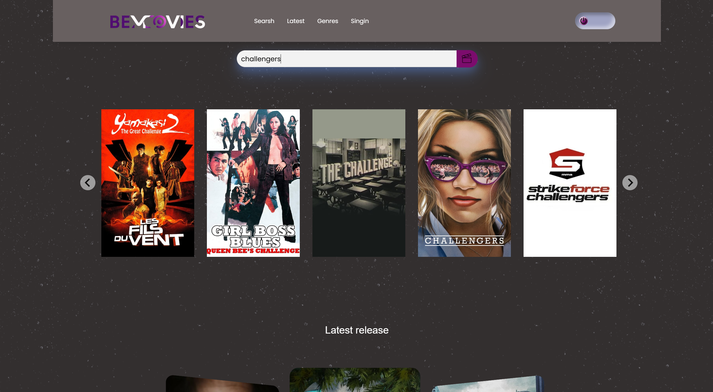
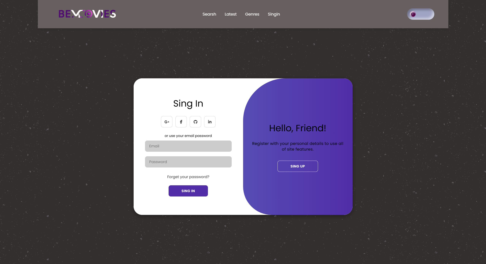
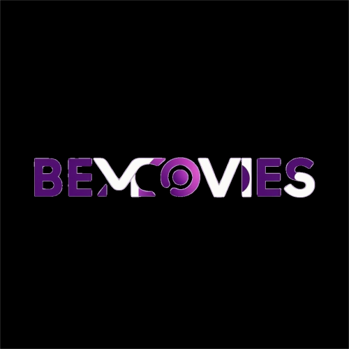

# BeMovies
## 📋 Project Overview
Welcome to BeMovies, an app for discovering films!  
This application lets you check the latest releases,  
sort films by genre and search for films to find out more about them. 

## 📱 Features

- View the latest movie releases.
- Sort movies by genre.
- Search for specific films.
- See details of a film: year of release, rating, description, genres and cast.
- Light/dark mode toggle

## 📸 Project Preview





## 📂 Project Structure
- index.html
- RegisterLogin.html
- assets/
  - img/
    - Accueil-Screenshot.png
    - RegisterLogin-Screenshot.png
    - logo-BEMOVIE-4.svg
  - css/
    - Accueil.css
- js/
  - app.js


# Tech Stack

**Client:** 
- HTML/CSS (Sass) for the front-end.
- JavaScript for dynamic functionalities.
- TMDB API to retrieve film data.

**Server:** 


## ⚙️ How to Run the Project

Follow these steps to set up and run BeMovies locally.        
Clone the repository to your local machine using Git:

```bash
  git clone https://github.com/your-username/bemovies.git
  cd bemovies
```
    
## API configuration


- Créez un compte sur TMDB pour obtenir votre clé API.
- Ajoutez votre clé API dans le fichier `.env` comme suit :
  ```
  REACT_APP_API_KEY=VotreCléAPI
  ```


## Lessons Learned

 If your question is "What did you learn while building this project? What challenges did you face and how did you overcome them?" take a look ⬇️

### 1. 

#### Problem


#### Solution


# Tips and Tricks

- To obtain the API key, register on TMDB.
- Make sure you include the Bearer authorization in the headers of your requests.
- Use the DISCOVER, GENRES, and MOVIES endpoints of the TMDB API.
- 
## 🎨 Design overview
The application design is based on the provided Figma template, with my personal touch added to make the development process more enjoyable and fun.

[Figma - BeMovies project design](https://www.figma.com/proto/jT6U3cABdKEUDRVTUJSbQd/BeMovies?node-id=1-2&p=f&t=fyC6QQ80OmNlIvq7-0&scaling=min-zoom&content-scaling=fixed&page-id=0%3A1)

## 🖼️ Logo
Here's the logo for the BeMovies application :




## 🌐 Live Demo

Check out the deployed version here: [GitHub Pages](https://fauve-mce.github.io/BEmovies/)


## 🎥 Contributing

- Directed by : Fauve Mareels


Contributions are always welcome!

Feel free to contribute by creating issues or submitting pull requests.
